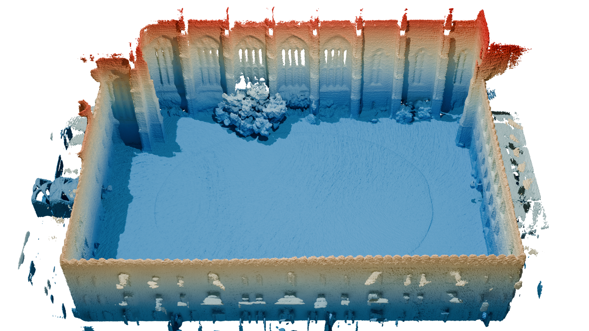

# DB-TSDF: Directional Bitmask-based Truncated Signed Distance Fields for Efficient Volumetric Mapping

<div align="center">
  <a href="https://youtu.be/P4Hx4bD1OmM" 
     style="display: inline-block; margin-right: 10px; text-decoration: none; vertical-align: middle;">
    
  </a>
</div>


This paper presents a high-efficiency, CPU-only volumetric mapping framework based on a Truncated Signed Distance Field (TSDF). The system incrementally fuses raw LiDAR point-cloud data into a voxel grid using a directional bitmask-based integration scheme, producing dense and consistent TSDF representations suitable for real-time 3D reconstruction. A key feature of the approach is that the processing time per point-cloud remains constant, regardless of the voxel grid resolution, enabling high resolution mapping without sacrificing runtime performance. In contrast to most recent TSDF/ESDF methods that rely on GPU acceleration, our method operates entirely on CPU, achieving competitive results in speed. Experiments on real-world open datasets demonstrate that the generated maps attain accuracy on par with contemporary mapping techniques. 



---

## Overview

This framework incrementally fuses LiDAR data into a dense voxel grid:  
- **Directional kernels** model LiDAR beam geometry and occlusion.  
- **Bitmask encoding** ensures constant-time updates per scan.  
- **Signed distance representation** differentiates free and occupied space.  
- **Multi-threaded C++** implementation inside ROS 2.  

The design emphasizes predictable runtime, high resolution, and full CPU compatibility, making it suitable for robotic platforms where GPU resources are limited.

<details>
  <summary>Index</summary>

- [1. Prerequisites](#1-prerequisites)
- [2. Installation](#2-installation)
  - [2.1 Install Locally](#21-install-locally)
  - [2.2 Install Using Docker](#22-install-using-docker)
- [3. Running the Code](#3-running-the-code)
- [4. Output Data and Services](#4-output-data-and-services)
</details>


## 1. Prerequisites

Before you begin, make sure you have ROS 2 Humble and Ubuntu 22.04 (or higher) installed on your system. These are the core requirements for the project to run smoothly. If you haven't installed ROS 2 Humble yet, follow the official [installation guide](https://docs.ros.org/en/humble/Installation.html) for your platform. This guide will walk you through all the necessary steps to set up the core ROS 2 environment on your system. 


<p align="right">(<a href="#readme-top">back to top</a>)</p> 

## 2. Installation

### Install localy
To install and build the project, simply clone the repository as follows:

   ```bash
   git clone https://github.com/robotics-upo/DB-TSDF.git
   cd ..
   colcon build
   source install/setup.bash
   ```

### Install using Docker
Follow these steps to build and run DB-TSDF inside a Docker container:
1. Clone the repository:
    ```bash
    git clone https://github.com/robotics-upo/DB-TSDF.git
    cd DB-TSDF
    ```

2. Build the Docker image:
    ```bash
    docker build -t db_tsdf_ros2:humble .
    ```

3. Allow Docker to access the X server (for GUI like RViz):
    ```bash
    xhost +local:docker
    ```

4. Run the container
    ```bash
    docker run -it \
      --env="DISPLAY" \
      --env="QT_X11_NO_MITSHM=1" \
      --volume="/tmp/.X11-unix:/tmp/.X11-unix:rw" \
      --name db_tsdf_container \
      db_tsdf_ros2:humble
    ```
The Dockerfile sets up the entire environment and downloads the DB-TSDF code automatically.


<p align="right">(<a href="#readme-top">back to top</a>)</p> 

## 3. Running the Code

The code can be launched automatically using one of the available launch files. There is a generic launch file, **mapper_college_launch.py**, which serves as a template for adapting the configuration to the specific dataset. There are predefined launch files tailored for the College and Mai City datasets.

To launch the code, use the following example command:
   ```bash
   ros2 launch db_tsdf mapper_college_launch.py
   ```
This command will start the node and prepare it to receive information via the topics. The node will remain in a waiting state until data is published. 

Along with the node and bag file, RViz visualization will also be launched to display a 3D representation of the environmen

To feed data, simply play a recorded ROS 2 bag in another terminal:
   ```bash
   ros2 bag play /path/to/your_dataset
   ```

<p align="right">(<a href="#readme-top">back to top</a>)</p> 


## 4. Output data and Services

The node provides ROS 2 services to export the reconstructed map:
- Mesh (STL)
   ```bash
   ros2 service call /save_grid_mesh std_srvs/srv/Trigger "{}"
   ```
- Voxel Point Cloud
   ```bash
   ros2 service call /save_grid_ply std_srvs/srv/Trigger "{}"   # grid_data.ply
   ros2 service call /save_grid_pcd std_srvs/srv/Trigger "{}"   # grid_data.pcd
   ```
- Voxel Statistics (CSV)
   ```bash
   ros2 service call /save_grid_csv std_srvs/srv/Trigger "{}"
    ```

<p align="right">(<a href="#readme-top">back to top</a>)</p> 


## Acknowledgements


This work was supported by the grants PICRA 4.0 (PLEC2023-010353), funded by the Spanish Ministry of Science and Innovation and the Spanish Research Agency (MCIN/AEI/10.13039/501100011033); and COBUILD (PID2024-161069OB-C31), funded by the  panish Ministry of Science, Innovation and Universities, the Spanish Research Agency (MICIU/AEI/10.13039/501100011033) and the European Regional Development Fund (FEDER, UE).