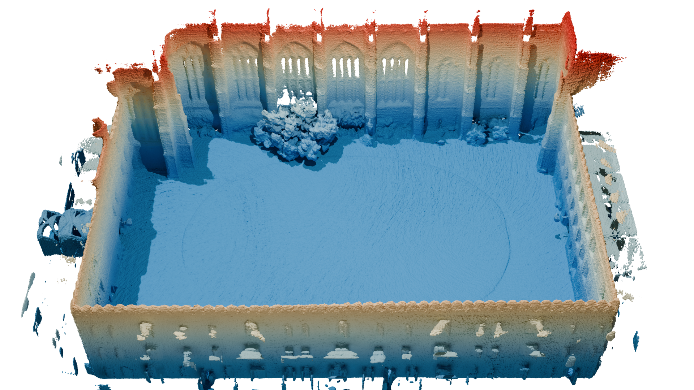

<h1 align="center"><a href="https://arxiv.org/abs/2509.20081" style="text-decoration:none;color:inherit;">DB-TSDF: Directional Bitmask-based Truncated Signed Distance Fields for Efficient Volumetric Mapping</a></h1>

<h3 align="center">
  Accepted at the <a href="https://2026.ieee-icra.org/">IEEE International Conference on Robotics and Automation (ICRA) 2026</a>
</h3>

<p align="center">
  <a href="https://robotics-upo.github.io/DB-TSDF/"></a>
  <a href="https://youtu.be/_kWJEkxv4lk"></a>
  <a href="https://arxiv.org/abs/2509.20081"></a>
</p>


**DB-TSDF** presents a high-efficiency, CPU-only framework for volumetric mapping. It utilizes a novel directional bitmask-based integration scheme to incrementally fuse LiDAR data into a dense voxel grid.

Key features include:
- **Directional Kernels:** Efficiently model beam geometry and occlusion in 3D.
- **Bitmask Encoding:** Ensures constant-time updates per scan, independent of grid resolution.
- **High Performance:** Multi-threaded C++ implementation fully integrated with ROS 2.

The design prioritizes predictable runtime and high-resolution reconstruction, making it an ideal solution for robotic platforms with limited GPU resources. 




## 1. Prerequisites

Before you begin, make sure you have ROS 2 Humble and Ubuntu 22.04 (or higher) installed on your system. These are the core requirements for the project to run smoothly. If you haven't installed ROS 2 Humble yet, follow the official [installation guide](https://docs.ros.org/en/humble/Installation.html) for your platform. This guide will walk you through all the necessary steps to set up the core ROS 2 environment on your system. 


 

## 2. Installation

### Install localy
To install and build the project, simply clone the repository as follows:

   ```bash
   git clone https://github.com/robotics-upo/DB-TSDF.git
   cd ..
   colcon build
   source install/setup.bash
   ```

### Install using Docker
Follow these steps to build and run DB-TSDF inside a Docker container:
1. Clone the repository:
    ```bash
    git clone https://github.com/robotics-upo/DB-TSDF.git
    cd DB-TSDF
    ```

2. Build the Docker image:
    ```bash
    docker build -t db_tsdf_ros2:humble .
    ```

3. Allow Docker to access the X server (for GUI like RViz):
    ```bash
    xhost +local:docker
    ```

4. Run the container
    ```bash
    docker run -it \
      --env="DISPLAY" \
      --env="QT_X11_NO_MITSHM=1" \
      --volume="/tmp/.X11-unix:/tmp/.X11-unix:rw" \
      --name db_tsdf_container \
      db_tsdf_ros2:humble
    ```
The Dockerfile sets up the entire environment and downloads the DB-TSDF code automatically.


 

## 3. Running the Code

The launch system uses a single main launch file (`db_tsdf_launch.py`) and a config argument to specify which dataset configuration to load.

This argument (e.g., `college`) will automatically load the corresponding parameter file (`college.yaml`) and the RViz configuration (`college.rviz`).

First, open a terminal, source your workspace, and run the launch file. The node will start, RViz will open, and the system will wait for data.

To launch using the college configuration:
   ```bash
   ros2 launch db_tsdf db_tsdf_launch.py config:=college
   ```


To feed data, simply play a recorded ROS 2 bag in another terminal:
   ```bash
   ros2 bag play /path/to/your_dataset
   ```

 


## 4. Configuration

The system is highly configurable via YAML parameters (e.g., `config/college.yaml`).

### Core Parameters
| Parameter | Type | Description | Default |
| :--- | :---: | :--- | :---: |
| `in_cloud` | `string` | Input PointCloud2 topic | `/os_cloud_node/points` |
| `odom_frame_id` | `string` | Fixed frame for TF lookup | `odom` |
| `use_tf` | `bool` | Enable/Disable TF transformations | `True` |

### Grid Definition
| Parameter | Type | Description | Default |
| :--- | :---: | :--- | :---: |
| `tdf_grid_res` | `float` | Voxel side length in meters | `0.05` |
| `tdf_max_cells` | `int` | Max active cells in hash table | `75000` |
| `tdfGridSize*_low/high` | `float` | Physical volume boundaries | `+/-100` |

### Integration Kernel
| Parameter | Type | Description | Default |
| :--- | :---: | :--- | :---: |
| `kernel_size` | `int` | Kernel size (odd number) | `11` |
| `bins_az` / `bins_el` | `int` | Angular discretization | `360` |
| `occ_min_hits` | `int` | Min measurements to mark occupied | `50` |


## 5. Output Data and Services

The node provides ROS 2 services to export the reconstructed map:

- Mesh (STL)
   ```bash
   ros2 service call /save_grid_mesh std_srvs/srv/Trigger "{}"
   ```

- Voxel Point Cloud
   ```bash
   ros2 service call /save_grid_ply std_srvs/srv/Trigger "{}"   # grid_data.ply
   ros2 service call /save_grid_pcd std_srvs/srv/Trigger "{}"   # grid_data.pcd
   ```

- Voxel Statistics (CSV)
   ```bash
   ros2 service call /save_grid_csv std_srvs/srv/Trigger "{}"
    ```

 

<p align="right">(<a href="#readme-top">back to top</a>)</p>
## Citation
If you use DB-TSDF in your research, please cite our ICRA 2026 paper:

```bibtex
@inproceedings{maese2026dbtsdf,
  title={DB-TSDF: Directional Bitmask-based Truncated Signed Distance Fields for Efficient Volumetric Mapping},
  author={Maese, Jose E. and Caballero, Fernando and Merino, Luis},
  booktitle={2026 IEEE International Conference on Robotics and Automation (ICRA)},
  year={2026}
}
```

 


## Acknowledgements


This work was supported by the grants PICRA 4.0 (PLEC2023-010353), funded by the Spanish Ministry of Science and Innovation and the Spanish Research Agency (MCIN/AEI/10.13039/501100011033); and INSERTION (PID2021-127648OB-C31), funded by the "Agencia Estatal de Investigación - Ministerio de Ciencia, Innovación y Universidades" and the "European Union NextGenerationEU/PRTR".
